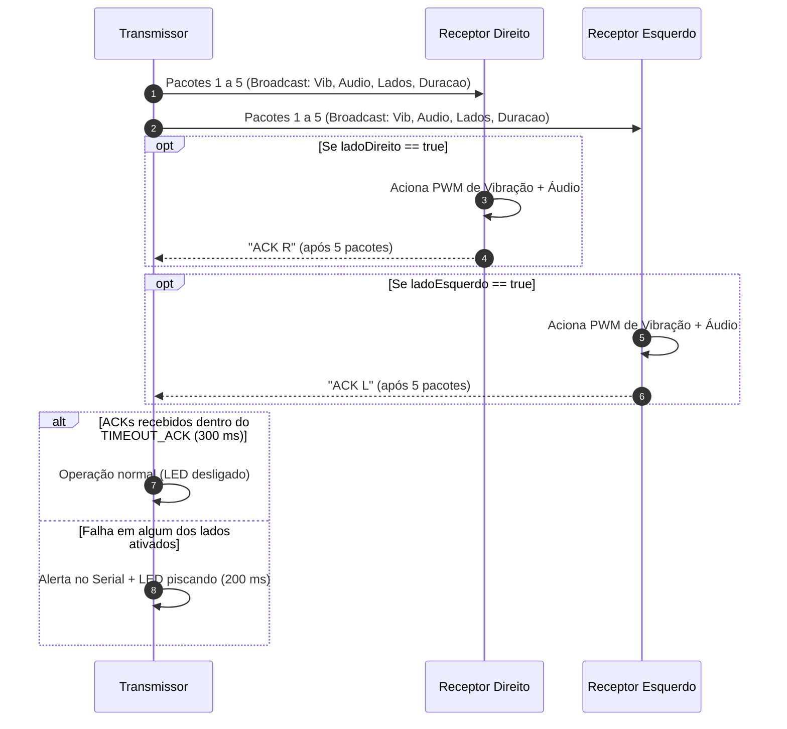

# Documentação das Alterações do Protocolo ESP-NOW
**Projeto:** Bicicleta Semiautônoma — Sistema de Sinalização e Feedback Háptico/Sonoro  
**Arquivo Principal:** [`Rede 50ms - Test.ino`](file:///h:/Meu%20Drive/projeto_bicicleta/Rede%2050ms%20-%20Test.ino)  

---

## 1. Visão Geral

Este documento descreve as alterações realizadas na estrutura de dados e na lógica de transmissão e recepção da rede sem fio baseada em **ESP-NOW**.

A rede conecta uma placa transmissora central (mestre) a duas placas receptoras periféricas montadas nos lados **Direito (R)** e **Esquerdo (L)** da bicicleta, responsáveis pelo acionamento de atuadores de vibração (motores hápticos) e dispositivos emissores de áudio (ex: DFPlayer Mini).

---

## 2. Comparativo da Estrutura de Dados (`struct_message`)

### Versão Anterior
O protocolo original enviava apenas dados genéricos de PWM e duração:
```cpp
typedef struct struct_message {
    int valor;
    int duracao;
} struct_message;
```

### Nova Versão Implementada
A nova estrutura foi enriquecida com controle direcional, comandos de áudio e vibração em formato empacotado (`__attribute__((packed))`) para otimizar o uso da banda de rádio:

```cpp
typedef struct __attribute__((packed)) {
    uint8_t audioAtivo;            // 0 = Desligado | 1 = Tocar Áudio
    uint8_t intensidadeVibracao;   // 0x00 a 0xFF (0 a 255) - Potência do PWM de vibração
    uint16_t duracao;              // Duração da vibração em milissegundos (0 a 65.535 ms)
    bool ladoDireito;              // true (1) = Aciona lado Direito | false (0)
    bool ladoEsquerdo;             // true (1) = Aciona lado Esquerdo | false (0)
    uint8_t pastaAudio;            // Número da pasta (ex: 0x01 a 0x63 / 1 a 99)
    uint8_t arquivoAudio;          // Identificador do arquivo/faixa (0x00 a 0xFF / 0 a 255)
} struct_message;
```

### Detalhamento dos Campos

| Campo | Tipo | Tamanho | Faixa de Valores | Descrição |
| :--- | :---: | :---: | :---: | :--- |
| `audioAtivo` | `uint8_t` | 1 byte | `0` ou `1` | Flag que determina se o receptor deve emitir som. |
| `intensidadeVibracao` | `uint8_t` | 1 byte | `0x00` a `0xFF` (0-255) | Nível do ciclo de trabalho (PWM) do atuador de vibração. |
| `duracao` | `uint16_t` | 2 bytes | `0` a `65.535 ms` | Tempo de permanência do atuador ligado. |
| `ladoDireito` | `bool` | 1 byte | `true` ou `false` | Se `true`, autoriza o receptor direito a processar o comando. |
| `ladoEsquerdo` | `bool` | 1 byte | `true` ou `false` | Se `true`, autoriza o receptor esquerdo a processar o comando. |
| `pastaAudio` | `uint8_t` | 1 byte | `0x00` a `0xFF` (0-255) | Índice da pasta de áudio no cartão de memória. |
| `arquivoAudio` | `uint8_t` | 1 byte | `0x00` a `0xFF` (0-255) | Identificador da faixa/arquivo de áudio a ser reproduzido. |

> **Tamanho total:** Apenas **8 bytes**, garantindo transmissão de baixíssima latência e mínimo consumo de energia.

---

## 3. Alterações na Lógica dos Receptores (`OnDataRecv`)

1. **Filtragem Seletiva por Lado:**
   - O receptor configurado como `MODO_RECEPTOR_DIREITO` ignora imediatamente o pacote se `data.ladoDireito == false`.
   - O receptor configurado como `MODO_RECEPTOR_ESQUERDO` ignora imediatamente o pacote se `data.ladoEsquerdo == false`.

2. **Ativação de Vibração:**
   - O valor de `data.intensidadeVibracao` é aplicado diretamente no pino PWM configurado (`pinoPWM`).
   - O temporizador de desligamento (`tempoDesligarMotor = millis() + data.duracao`) garante que o atuador seja desligado caso o sinal seja interrompido.

3. **Gancho para Reprodução de Áudio:**
   - Inclusão do ponto de chamada condicional `if (data.audioAtivo == 1)` para disparar o módulo de som com base em `pastaAudio` e `arquivoAudio`.

4. **Confirmação (ACK):**
   - Mantida a política de envio de confirmação (`"ACK R"` ou `"ACK L"`) a cada **5 pacotes** recebidos com sucesso.

---

## 4. Alterações na Lógica do Transmissor (`loop`)

1. **Envio dos Parâmetros Completos:**
   - O transmissor monta o pacote definindo intensidade em hexadecimal, duração, roteamento por lado e parâmetros do arquivo de áudio.

2. **Detecção Inteligente de Falha de Conexão (Watchdog de ACK):**
   - O alerta de desconexão (timeout de 300 ms) agora avalia apenas os lados que foram habilitados no comando:
     ```cpp
     bool falhaR = data.ladoDireito && !ackRecebidoR;
     bool falhaL = data.ladoEsquerdo && !ackRecebidoL;
     ```
   - Isso impede que alertas falsos de desconexão ocorram quando um comando for direcionado exclusivamente a um dos lados.

3. **Sinalização Visual (LED no Pino 2):**
   - Se houver falha de comunicação comprovada nos lados acionados, o LED pisca em intervalos de 200 ms; caso contrário, permanece apagado.

---

## 5. Fluxo de Comunicação



---

## 6. Como Selecionar o Modo da Placa

No início do arquivo [`Rede 50ms - Test.ino`](file:///h:/Meu%20Drive/projeto_bicicleta/Rede%2050ms%20-%20Test.ino#L5-L7), descomente **apenas uma** das três diretivas:

```cpp
// Para a placa transmissora:
#define MODO_TRANSMISSOR 
//#define MODO_RECEPTOR_DIREITO
//#define MODO_RECEPTOR_ESQUERDO

// Para a placa receptora direita:
//#define MODO_TRANSMISSOR 
#define MODO_RECEPTOR_DIREITO
//#define MODO_RECEPTOR_ESQUERDO

// Para a placa receptora esquerda:
//#define MODO_TRANSMISSOR 
//#define MODO_RECEPTOR_DIREITO
#define MODO_RECEPTOR_ESQUERDO
```

---

## 7. Evolução para a Versão 2 (V2) — Suporte a Arquivos > 255 (`0xFF`)

**Arquivo correspondente:** [`Rede 50ms - v2.ino`](file:///h:/Meu%20Drive/projeto_bicicleta/Rede%2050ms%20-%20v2.ino)

### 7.1. O Desafio Técnico
Ao projetar a sinalização sonora com muitas faixas de áudio ou bibliotecas extensas, o identificador do arquivo pode ultrapassar `255` em hexadecimal (`0xFF`), como por exemplo faixas `300` (`0x012C`), `1000` (`0x03E8`), etc.

Dois caminhos foram analisados para atender às restrições de **tempo máximo de 250 ms** e **mínimo consumo de processamento**:

1. **Abordagem por Fragmentação (Dividir o arquivo em múltiplos pacotes):**
   - *Desvantagens:* Exigiria buffers dinâmicos de memória, controle de sequência, máquina de estados para remontagem e múltiplos ciclos de envio pelo rádio.
   - *Impacto de Latência:* Aumentaria o tempo total de transmissão para dezenas de milissegundos e aumentaria exponencialmente o risco de perda de pacote.
2. **Abordagem por Expansão de Tipo (Recomendada e Adotada na V2):**
   - Como os arquivos `.mp3` residem fisicamente no cartão SD local de cada receptor, o rádio precisa apenas transmitir o **número/índice** da faixa a ser executada.
   - Expandindo o campo `arquivoAudio` de `uint8_t` (8 bits) para `uint16_t` (16 bits), passa-se a suportar até **65.535 arquivos** por pasta com envio atômico em **1 único pacote**.

### 7.2. Comparativo de Desempenho e Recursos

| Métrica / Requisito | Fragmentar em Vários Pacotes | Solução V2 (`uint16_t`) |
| :--- | :---: | :---: |
| **Tempo de Transmissão** | 20 ms a 100 ms | **< 1 ms** (Margeia com folga o limite de 250 ms) |
| **Consumo de CPU (Transmissor e Receptor)** | Alto (divisão, headers e remontagem) | **Nulo / Mínimo** (atribuição direta) |
| **Tamanho Total do Pacote** | Múltiplos pacotes de 8+ bytes | **9 bytes** em um único pacote |
| **Faixas de Áudio Suportadas** | Ilimitado (porém complexo) | **0 a 65.535** (`0x0000` a `0xFFFF`) |
| **Risco de Falha por Perda de Rádio** | Alto (se 1 pacote falhar, nada toca) | **Mínimo** (transmissão atômica) |

### 7.3. Estrutura de Dados da Versão 2 (`struct_message`)

```cpp
// Estrutura de dados comum V2 (Tamanho total: 9 bytes)
typedef struct __attribute__((packed)) {
    uint8_t audioAtivo;            // 0 = Desligado | 1 = Tocar Áudio (1 byte)
    uint8_t intensidadeVibracao;   // 0x00 a 0xFF (0 a 255) - Potência do PWM (1 byte)
    uint16_t duracao;              // Duração em milissegundos (0 a 65.535 ms) (2 bytes)
    bool ladoDireito;              // true / false - Habilita lado Direito (1 byte)
    bool ladoEsquerdo;             // true / false - Habilita lado Esquerdo (1 byte)
    uint8_t pastaAudio;            // 0x00 a 0xFF (Pastas de 0 a 255) (1 byte)
    uint16_t arquivoAudio;         // 0x0000 a 0xFFFF (Arquivos de 0 a 65.535) (2 bytes)
} struct_message;
```

### 7.4. Exemplo de Envio no Transmissor V2

```cpp
// Enviando comando para a Pasta 1, Faixa 300 (0x012C em hexadecimal)
data.audioAtivo = 1;
data.intensidadeVibracao = 0xC8; // 200 em decimal
data.duracao = 5000;             // 5000 ms (5 segundos)
data.ladoDireito = true;
data.ladoEsquerdo = true;
data.pastaAudio = 0x01;
data.arquivoAudio = 0x012C;      // Faixa 300 (> 255)

esp_now_send(broadcastAddress, (uint8_t *) &data, sizeof(data));
```

